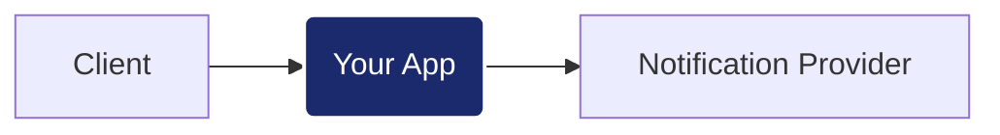

# Python Backend Challenge: Notification Service

## El Reto
Implementar un servicio de notificaciones que actúe como mediador entre los clientes y un proveedor externo. Tu objetivo es diseñar una solución sólida que pase la suite de validación de rendimiento y resiliencia.

## Contrato de API
Para que la suite de tests (k6) pueda validar tu solución, debes implementar estrictamente los siguientes endpoints en el **puerto 5000**:

- **Registro de Solicitud:** `POST /v1/requests`  
  Cuerpo (JSON): `{"to": "string", "message": "string", "type": "email|sms|push"}`  
  Respuesta: `201 Created` con JSON `{"id": "string"}`.

- **Procesamiento de Envío:** `POST /v1/requests/{id}/process`  
  Descripción: Lanza la integración con el proveedor externo.  
  Respuesta: `200 OK` o `202 Accepted`.

- **Consulta de Estado:** `GET /v1/requests/{id}`  
  Respuesta: `200 OK` con JSON `{"id": "string", "status": "queued|processing|sent|failed"}`.

---

## Integración con el Provider
El servicio de notificaciones está disponible en `localhost:3001`. Requiere el encabezado de seguridad: `X-API-Key: test-dev-2026`.

- **Notificaciones:** `/v1/notify` (Esquema definido en los docs del provider).
- **Documentación:** Puedes consultar los Swagger Docs en `http://localhost:3001/docs`.

---

## Ejecución y Evaluación

1. **Levantar infraestructura:** `docker-compose up -d provider influxdb grafana`
2. **Tu aplicación:** `docker-compose up -d --build app`
3. **Validación (k6):** `docker-compose run --rm load-test`
4. **Resultados:** Visualiza el scorecard en tiempo real en [Grafana (localhost:3000)](http://localhost:3000/d/backend-performance-scorecard/)

*Se valorará la robustez frente a errores inesperados, la calidad de la implementación y la arquitectura del pipeline de procesamiento.*
